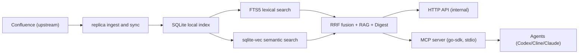

# 0003: confluence-replica service and MCP

## High-level design

`confluence-replica` теперь живет на одном локальном SQLite runtime. Мир от этого не стал мудрее, но локальный запуск стал заметно менее хрупким.

1. Внутренний сервисный контур (Go + SQLite):
   - ingest (`bootstrap` / `sync`) тянет дерево страниц из Confluence;
   - chunking + embeddings индексируют контент в локальную SQLite базу;
   - lexical search работает через `FTS5`;
   - semantic search работает через `sqlite-vec` `vec0`;
   - deterministic RAG и digest работают по локальному индексу;
   - rebuild является официальным reset / repair / reindex сценарием.

2. Агентский контур (`confluence-replica-mcp` facade):
   - отдельный бинарь `cmd/mcp`;
   - реализован через `modelcontextprotocol/go-sdk`;
   - публикует read-first интерфейс с guardrail-ами на запись:
     - tools: `search`, `ask`, `get_tree`, `what_changed`, `update_page`, `create_child_page`
     - resource templates: `confluence://page/{page_id}`, `confluence://chunk/{chunk_id}`, `confluence://digest/{date}`
     - prompts: `daily_brief`, `investigate_page`, `compare_versions`

Принцип границы:

- HTTP API (`cmd/api`) остается внутренним API для runtime и ops.
- MCP не зеркалит весь REST; это узкий интерфейс для агентного доступа к локальному индексу и ограниченных page write-операций.

## Runtime rules that matter

- Локальный runtime поддерживает только SQLite:
  - `database.path` заменяет `database.dsn`;
  - директория и база создаются автоматически при первом запуске;
  - schema bootstrap идет из одного embedded schema файла;
  - Postgres, dual-write и compatibility layer намеренно отсутствуют.

- Профиль индекса хранится явно в `replica_meta`:
  - `schema_version`
  - `embedding_provider`
  - `embedding_model`
  - `embedding_dimension`
  - `chunking_version`
  - `embedding_normalization`
  - при несовпадении runtime падает с понятным `reindex required`

- Семантический поиск не притворяется магией:
  - lexical side берет top `50` через `FTS5 MATCH ... ORDER BY rank`
  - vector side берет top `50` через `vec0` cosine distance
  - в Go выполняется простой Reciprocal Rank Fusion с `rrf_k = 60`
  - никакой псевдо-нормализации `bm25` и cosine в одну универсальную шкалу

- Лексический ranking/snippets остаются внутри SQLite:
  - используется `rank`
  - snippets отдаются через `snippet()`
  - дополнительная пост-обработка в Go не нужна

- CGO является частью контракта продукта:
  - `mattn/go-sqlite3` требует `CGO_ENABLED=1` и `gcc`
  - `sqlite-vec` регистрируется через `sqlite_vec.Auto()` до открытия соединений
  - локальные сборки и CI обязаны использовать build tag `sqlite_fts5`

- MCP можно запускать в local-only режиме без Confluence PAT:
  - `cmd/mcp` загружает конфиг с `RequireConfluenceToken=false`
  - если в конфиге `keychain://...`, MCP не падает из-за секрета и работает только по локальной реплике

- MCP write tools защищены флагом и сразу обновляют локальный индекс:
  - `mcp.write_enabled=false` по умолчанию; при выключенном флаге запись возвращает `write_disabled`
  - `update_page` требует `page_id` и хотя бы одно из `title`/`body_storage`; MCP делает лёгкую pre-validation входа и при явной невалидности возвращает `validation_error`
  - `body_storage` для `update_page`/`create_child_page` ожидается в формате Confluence storage XHTML, но проверка в MCP эвристическая; строгая валидация выполняется Confluence API
  - при успешном `update_page` / `create_child_page` страница сразу upsert-ится в локальную реплику (для child page дополнительно refresh/upsert родителя)
  - если upstream применился, но локальный refresh не завершился, возвращается `local_refresh_failed` чтобы агент не считал локальный state консистентным
  - ошибки write surface отдаются как MCP tool-call errors с token-ами в message: `write_disabled`, `local_refresh_failed`, `version_conflict`, `auth_error`, `upstream_error`

- Sync roots задаются через `confluence.parent_ids`:
  - `bootstrap` и `sync` без override используют полный scope из конфига
  - ручной override (`--parent-id` / `--parent-ids`) работает как partial scope и не создает ложные `deleted` для других корней

- Rebuild является штатным сценарием:
  - `replica rebuild` удаляет `db`, `db-wal`, `db-shm`
  - затем создается новая схема и выполняется полный repull из Confluence
  - rebuild-on-change является единственной поддерживаемой стратегией миграции

## Dependencies

### Runtime dependencies

- Go `1.25+`
- `github.com/modelcontextprotocol/go-sdk`
- `github.com/mattn/go-sqlite3`
- `github.com/asg017/sqlite-vec-go-bindings/cgo`
- YAML config parser (`gopkg.in/yaml.v3`)
- build tag `sqlite_fts5`
- `gcc` и `CGO_ENABLED=1`

### Operational dependencies

- Конфиг `config/config.yaml` с рабочим `database.path`
- Для ingest из Confluence:
  - Confluence URL
  - PAT/token через Keychain reference (`keychain://codex_confluence_pat`)
  - `confluence.parent_ids`
- Для semantic embeddings:
  - Ollama endpoint + embedding model

### Agent integration dependencies

- Codex/Cline конфиг с `mcp_servers.confluence_replica`
- Исполняемый `bin/mcp` или `go run -tags sqlite_fts5 ./cmd/mcp`
- Go integration smoke: `go test -tags "integration sqlite_fts5" ./integration`

## Intentional non-goals

- Нет Postgres compatibility layer
- Нет dual-write
- Нет dormant migration chain "на всякий случай"
- Нет попыток склеить `bm25` и cosine через хрупкую нормализацию score

## TODO

- [ ] Добавить contract snapshot тесты для MCP ответов (`tools/call`, `resources/read`, `prompts/get`) для контроля breaking changes.
- [ ] Расширить integration smoke beyond surface listing: добавить contract checks для `tools/call`, `resources/read`, `prompts/get` без привязки к живому upstream.
- [ ] Реализовать явный `get_page_version` (с выбором версии), сейчас через MCP читается только current page resource.
- [ ] Реализовать отдельный инструмент сравнения версий как tool (сейчас `compare_versions` есть только как prompt-шаблон).
- [ ] Улучшить observability MCP слоя: структурные метрики по latency и errors на tool, resource и prompt handlers.
- [ ] Зафиксировать единую error taxonomy для MCP (resource not found vs validation vs backend unavailable).
- [ ] Добавить e2e сценарии offline mode как отдельные тесты и checklist.
- [ ] Научить реплику разбирать содержимое диаграмм (`drawio`) на семантические изменения, а не только помечать `diagram_change_detected`.
