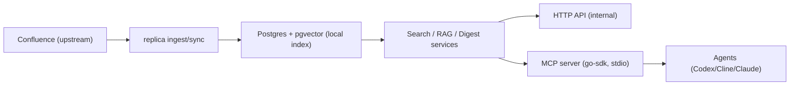

# 0003: confluence-replica service and MCP

## High-level design

`confluence-replica` по-прежнему живет в двух контурах. Вселенная от этого не стала добрее, но зато все работает быстрее и стабильнее.

1. Внутренний сервисный контур (Go + Postgres):
   - ingest (`bootstrap` / `sync`) тянет дерево страниц из Confluence;
   - chunking + embeddings индексируют контент в локальную БД;
   - hybrid search и deterministic RAG работают по локальному индексу;
   - digest строит ежедневные сводки изменений.

2. Агентский контур (`confluence-replica-mcp` facade):
   - отдельный бинарь `cmd/mcp`;
   - реализован через `modelcontextprotocol/go-sdk`;
   - публикует retrieval-only интерфейс:
     - tools: `search`, `ask`, `get_tree`
     - resource templates: `confluence://page/{page_id}`, `confluence://chunk/{chunk_id}`, `confluence://digest/{date}`
     - prompts: `daily_brief`, `investigate_page`, `compare_versions`

Принцип границы:
- HTTP API (`cmd/api`) остается внутренним API для runtime/ops.
- MCP не зеркалит весь REST; это узкий интерфейс для агентного доступа к уже проиндексированному знанию.

## Runtime rules that matter

- MCP можно запускать в local-only режиме без Confluence PAT:
  - `cmd/mcp` загружает конфиг с `RequireConfluenceToken=false`;
  - если в конфиге `keychain://...`, MCP не падает из-за секрета и работает только по локальной реплике.

- Эмбеддинги теперь model-agnostic по размерности:
  - в `chunk_embeddings` хранится `embedding_dim`;
  - hybrid vector search фильтрует кандидатов по `embedding_dim`;
  - это устраняет конфликт вида `expected 1536 dimensions, not 768`.
  - миграция: `migrations/002_embedding_dimension_compat.sql`.

- Логирование унифицировано во всех бинарях:
  - дефолт: `INFO`;
  - `logging.level` в конфиге (`ERROR|INFO|DEBUG`);
  - `--quiet` принудительно ставит `ERROR`;
  - `--verbose` принудительно ставит `DEBUG`.

- PAT храним в macOS Keychain:
  - в `config/config.yaml`: `confluence.token: "keychain://codex_confluence_pat"` (опционально `?account=<user>`);
  - в рантайме читается через `security find-generic-password`.
  - полезная проверка: `security find-generic-password -s codex_confluence_pat -w`

- Локальный runtime-ритуал:
  - `make runtime-up` (поднимет Postgres и при необходимости Ollama + pull модели);
  - `make runtime-up-no-ollama` (если Ollama уже живет отдельно);
  - `make db-migrate`;
  - `make build` / `make build-mcp`;
  - `make mcp-smoke`.

## Dependencies

### Runtime dependencies

- Go `1.25+`
- `github.com/modelcontextprotocol/go-sdk` (MCP server SDK)
- `github.com/jackc/pgx/v5` (Postgres access)
- Postgres + extension `pgvector`
- YAML config parser (`gopkg.in/yaml.v3`)

### Infra / operational dependencies

- Docker/Compose для локального Postgres
- Конфиг `config/config.yaml` с рабочим `database.dsn`
- Для ingest из Confluence:
  - Confluence URL
  - PAT/token через Keychain reference (`keychain://codex_confluence_pat`)
- Для semantic embeddings:
  - Ollama endpoint + embedding model

### Agent integration dependencies

- Codex/Cline конфиг с `mcp_servers.confluence_replica`
- Исполняемый `bin/mcp` (или `go run ./cmd/mcp`)
- Smoke script: `scripts/mcp-smoke.py`

## TODO (нереализованное)

- [ ] Добавить contract snapshot тесты для MCP ответов (`tools/call`, `resources/read`, `prompts/get`) для контроля breaking changes.
- [ ] Добавить полноценный integration-smoke с реальным MCP client handshake в CI (не только локальный скрипт).
- [ ] Реализовать явный `get_page_version` (с выбором версии), сейчас через MCP читается только current page resource.
- [ ] Реализовать отдельный инструмент сравнения версий как tool (сейчас `compare_versions` есть только как prompt-шаблон).
- [ ] Улучшить observability MCP слоя: структурные метрики по latency/errors на tool/resource/prompt handlers.
- [ ] Зафиксировать единую error taxonomy для MCP (resource not found vs validation vs backend unavailable).
- [ ] Добавить e2e сценарии offline mode как отдельные тесты/чеклист (MCP работает при недоступном upstream Confluence, если локальный индекс уже есть).
