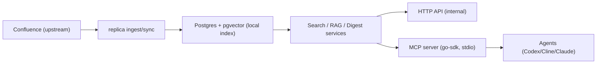

# 0003: confluence-replica service and MCP

## High-level design

`confluence-replica` разделен на два контура:

1. Внутренний сервисный контур (Go + Postgres):
   - ingest (`bootstrap` / `sync`) тянет дерево страниц из Confluence;
   - chunking + embeddings индексируют контент в локальную БД;
   - hybrid search и deterministic RAG работают по локальному индексу;
   - digest строит ежедневные сводки изменений.

2. Агентский контур (MCP facade):
   - отдельный бинарь `cmd/mcp`;
   - реализован через `modelcontextprotocol/go-sdk`;
   - публикует только retrieval-интерфейс:
     - tools: `search`, `ask`, `get_tree`
     - resource templates: `confluence://page/{page_id}`, `confluence://chunk/{chunk_id}`, `confluence://digest/{date}`
     - prompts: `daily_brief`, `investigate_page`, `compare_versions`

Принцип границы:
- HTTP API (`cmd/api`) остается внутренним API для runtime/ops.
- MCP не зеркалит весь REST; это узкий интерфейс для агентного доступа к уже проиндексированному знанию.

## Dependencies

### Runtime dependencies

- Go `1.25+`
- `github.com/modelcontextprotocol/go-sdk` (MCP server SDK)
- `github.com/jackc/pgx/v5` (Postgres access)
- Postgres + extension `pgvector`
- YAML config parser (`gopkg.in/yaml.v3`)

### Infra / operational dependencies

- Docker/Compose для локального Postgres (рекомендуемый путь)
- Конфиг `config/config.yaml` с рабочим `database.dsn`
- Для ingest из Confluence:
  - Confluence URL
  - PAT/token (может быть через Keychain secret ref)
- Для semantic embeddings (опционально, но полезно):
  - Ollama endpoint + embedding model

### Agent integration dependencies

- Codex/Cline конфиг с `mcp_servers.confluence_replica`
- Исполняемый `bin/mcp` (или `go run ./cmd/mcp`)
- Smoke script: `scripts/mcp-smoke.py`

## TODO (нереализованное)

- [ ] Добавить contract snapshot тесты для MCP ответов (`tools/call`, `resources/read`, `prompts/get`) для контроля breaking changes.
- [ ] Добавить полноценный integration-smoke с реальным MCP client handshake в CI (не только локальный скрипт).
- [ ] Реализовать явный `get_page_version` (с выбором версии), сейчас через MCP читается только current page resource.
- [ ] Реализовать отдельный инструмент сравнения версий как tool (сейчас `compare_versions` есть только как prompt-шаблон).
- [ ] Добавить pagination/limit guards для больших деревьев и больших выдач search с более строгими server-side лимитами.
- [ ] Улучшить observability MCP слоя: структурные метрики по latency/errors на tool/resource/prompt handlers.
- [ ] Зафиксировать единую error taxonomy для MCP (resource not found vs validation vs backend unavailable).
- [ ] Добавить e2e сценарии “offline mode” как отдельные тесты/чеклист (MCP работает при недоступном upstream Confluence, если локальный индекс уже есть).
